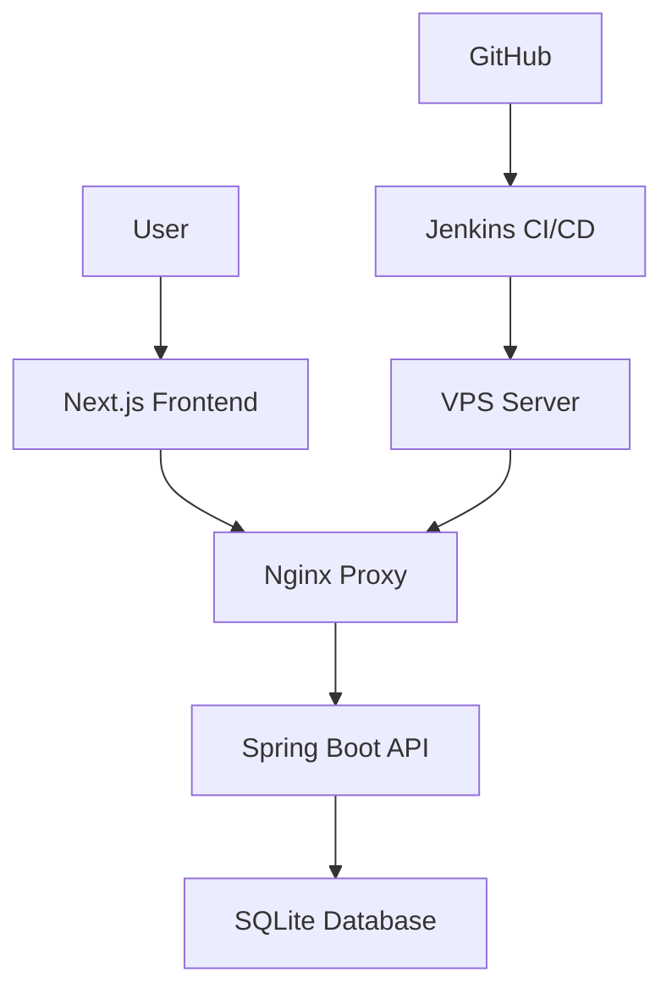

# Fin Africa Affordability Calculator

A clean, responsive loan affordability calculator that helps users determine loan eligibility based on their income and deductions.

**Live Demo:** https://fin.awesome.co.ke


### Features

- **Real-time calculations** - Instant loan eligibility computation
- **Responsive design** - Works on mobile, tablet, and desktop
- **Clean UI** - Simple, accessible interface
- **Input validation** - Comprehensive error handling
- **Currency formatting** - Proper currency formatting

### Tech Stack

- **Frontend:** Next.js + Tailwind CSS
- **Backend:** Spring Boot + SQLite
- **Infrastructure:** Nginx + Contabo VPS
- **CI/CD:** Jenkins automated deployment

### Architecture



### Getting Started

#### Prerequisites
- Bun 1.2.5
- Java 24.0.2
- Maven 3.9.11

#### Setup
**Clone the repository**
```bash
git clone git@github.com:chris-muiru/fin-affordability-calculator.git
cd fin-affordability-calculator
```

**Run the frontend**
```bash
cd frontend
bun install
bun run dev
```
Frontend available at: `http://localhost:3000`

**Run the backend**
```bash
cd backend
mvn spring-boot:run
```
API available at: `http://localhost:8080`

### How It Works

#### Calculation Logic
```javascript
const netIncome = grossIncome - totalDeductions;
const maxLoan = netIncome * 0.5; // 50% of net income
const isEligible = maxLoan >= 20000; // Minimum KES 20,000
```

### API Example
```json
Request:

POST /api/v1/loan
{
    "grossIncome": 100000,
    "deductions": 30000
}

Response:
{
    "netIncome": 70000.0,
    "maxLoan": 35000.0,
    "eligible": true,
    "message": "Congratulations! You qualify for a loan with Fin Africa",
    "nextStep": [
        "Prepare your income documentation",
        "Choose your preferred loan terms",
        "Contact our loan officers to start your application (+254758662445)"
    ]
}
```
### Deployment

- **Hosting:** Contabo VPS with Nginx reverse proxy
- **CI/CD:** Automated Jenkins pipeline
- **SSL:** Let's Encrypt certificates

### License

MIT License

---

**Built by Chris Muiru**  
Full-Stack Developer

[Live Demo](https://fin.awesome.co.ke) • [GitHub](https://github.com/chris-muiru)
